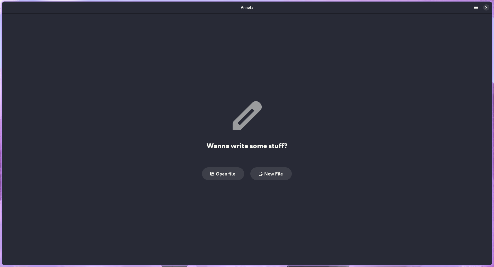

# Annota

Annota is a work in progress text editor built with Rust and GTK4 as an experiment for learning purposes.

## Will this ever release?
Most likely no, but if it does it'll be a flatpak.

## Should you use this?
I mean... I can't stop you.

# How to build

Use GNOME Builder to build the project and bundle it as a flatpak, or use VSCode's flatpak extension to do the same thing.